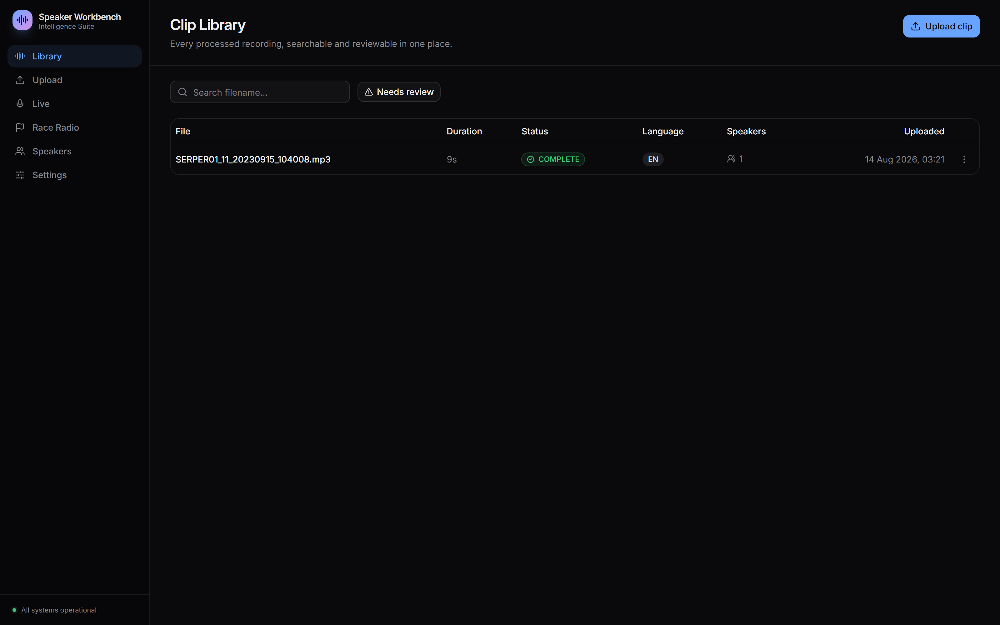
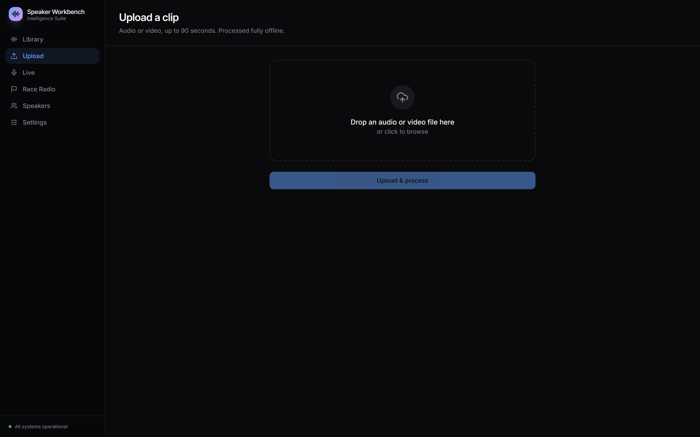
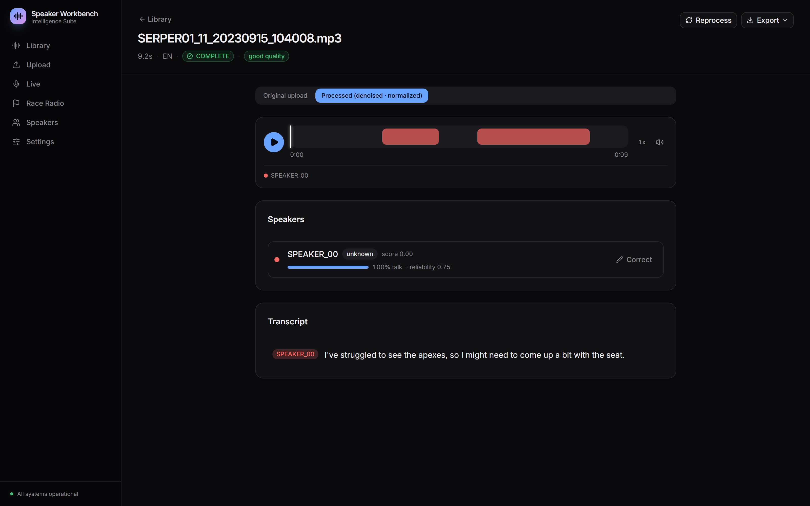
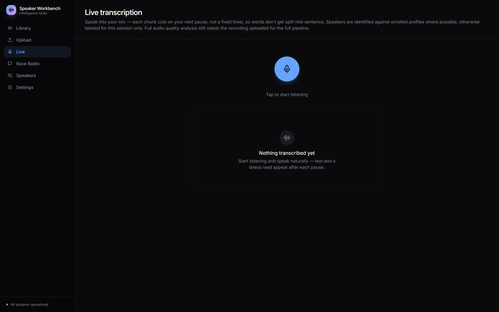
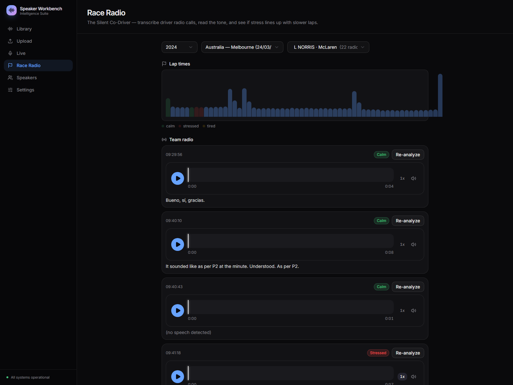
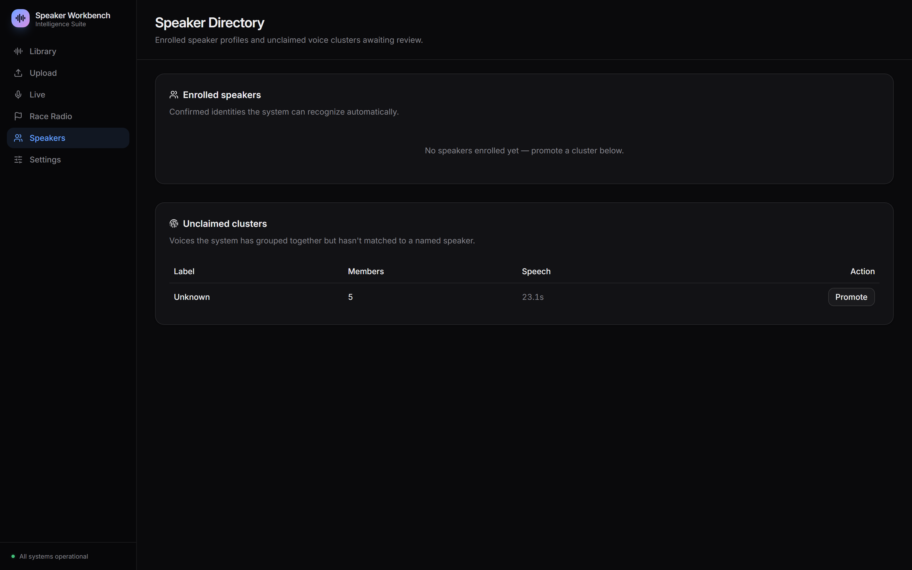
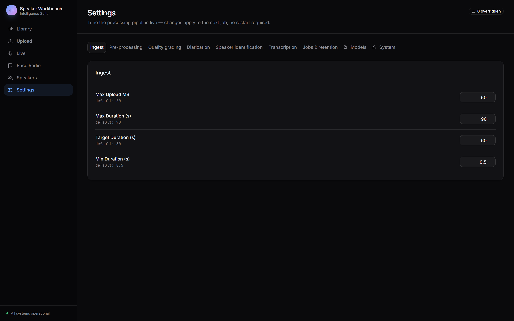
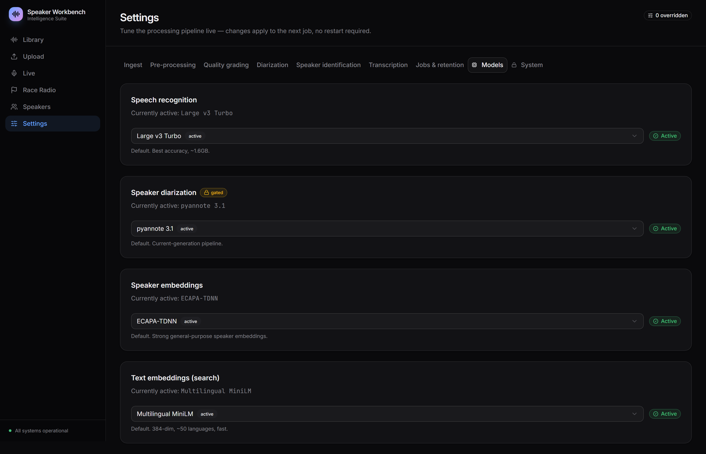
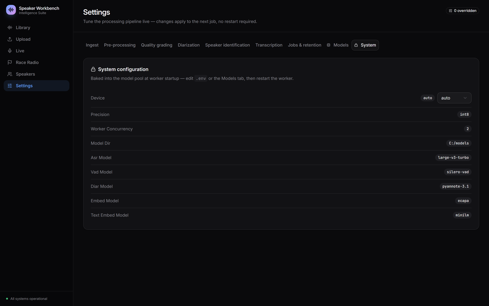

# Speaker Intelligence Workbench

An on-premises voice-intelligence workbench. Drop in an audio or video clip (≤90s) and it
runs a full offline pipeline — preprocess → transcribe → diarize → reconcile → embed →
identify speakers → index — then lets you review, correct, search, and export the result.
Models are baked into the worker image at build time and run with `HF_HUB_OFFLINE=1`:
no audio and no text ever leaves the box.

Three ways in: **batch upload**, **live microphone transcription**, and **Race Radio**, an
F1 team-radio analyzer that pulls driver radio calls and lines their vocal tone up against
lap times.



---

## Contents

- [What it does](#what-it-does)
- [Architecture](#architecture)
- [Quick start (Docker)](#quick-start-docker)
- [Running natively on Windows](#running-natively-on-windows)
- [The screens](#the-screens)
- [The pipeline, stage by stage](#the-pipeline-stage-by-stage)
- [Speaker identification model](#speaker-identification-model)
- [Search](#search)
- [Race Radio (F1)](#race-radio-f1)
- [Live transcription](#live-transcription)
- [Model catalog](#model-catalog)
- [API reference](#api-reference)
- [Configuration](#configuration)
- [Data model](#data-model)
- [Operations](#operations)
- [Testing](#testing)
- [Offline verification](#offline-verification)
- [What's scoped out (and where the seam is)](#whats-scoped-out-and-where-the-seam-is)
- [Layout](#layout)

---

## What it does

| Capability | Detail |
|---|---|
| Transcription | faster-whisper `large-v3-turbo` (CTranslate2), word timestamps + per-word logprobs, auto language detect |
| Diarization | pyannote 3.1, VAD-snapped turns, min-turn/merge-gap cleanup, overlap warning |
| Reconciliation | words assigned to turns by overlap, low-confidence smoothing, regrouped into utterances |
| Speaker ID | ECAPA-TDNN embeddings + pgvector, reliability-gated with margin and abstention |
| Enrollment | manual enroll, centroid recomputation, outlier detection, merge/reassign profiles |
| Clustering | unknown voices cluster across clips; promote a cluster to a real profile in one click |
| Calibration | EER sweep over enrolled data to sanity-check the identification threshold |
| Search | Postgres FTS, semantic (MiniLM + pgvector HNSW), or hybrid via reciprocal rank fusion |
| Export | SRT, VTT, RTTM, JSON, TXT |
| Live | mic capture, pause-aligned chunking, per-chunk diarize + identify, session-scoped speakers |
| Race Radio | OpenF1 session/driver/lap data, radio ingestion, heuristic tone classification |
| Ops | structured logs with correlation IDs, Prometheus metrics, hash-chained audit log, deletion receipts |
| Tuning | every pipeline knob editable live from the UI — applies to the next job, no restart |
| Models | download and activate alternate ASR/diarization/embedding models from Settings |

## Architecture

```
        ┌──────────┐        ┌────────────┐        ┌──────────┐
 audio  │   web    │  HTTP  │    api     │  arq   │  worker  │
 ─────► │ React/TS │ ─────► │  FastAPI   │ ─────► │ pipeline │
        └──────────┘        └────────────┘ (redis)└──────────┘
              ▲                    │                    │
              └── WebSocket ───────┘                    │
                 job progress                           ▼
                                            ┌────────────────────┐
                                            │ Postgres + pgvector│
                                            │ local disk (DATA_DIR)
                                            └────────────────────┘
```

- **api** (FastAPI) — ingest, listing, correction, search, admin, model catalog, WS progress.
  Owns no ML; it enqueues and reads.
- **worker** (arq) — every model lives here, loaded once into a `pool` at startup and shared
  across jobs. One file per pipeline stage under `worker/worker/stages/`.
- **postgres** — pgvector for speaker centroids and utterance embeddings (HNSW indexes),
  plus Postgres full-text search over the same utterances.
- **redis** — arq job queue and the pub/sub channel behind live progress events.
- **web** — React + Vite + TypeScript, Tailwind and shadcn/ui.

## Quick start (Docker)

```bash
cp .env.example .env                  # edit POSTGRES_PASSWORD / API_KEY
echo "<your-hf-token>" > .hf_token    # once — to accept pyannote's gated-model terms
make up                               # docker compose up -d --build
```

The worker image *build* downloads and verifies every model in `models/REGISTRY.yaml`. It
fails the build — not the first request — if anything is missing.

Then: web on `:5173`, API on `:8000`, Postgres on `:5432`, Redis on `:6379`.

The web UI reads its API key from `localStorage`. Once, in the browser console:

```js
localStorage.setItem("api_key", "<API_KEY from .env>")
```

Other targets: `make down` (stop), `make clean` (stop + drop volumes), `make logs`,
`make test`.

Dependencies are managed with [uv](https://docs.astral.sh/uv/) — `api/pyproject.toml` and
`worker/pyproject.toml` are installed via `uv pip install --system -r pyproject.toml`
inside each Dockerfile.

## Running natively on Windows

`scripts/dev.ps1` runs the Python side on the host and leaves Postgres/Redis in Docker —
faster to iterate on, and the only way the worker can reach a local GPU. One terminal each:

```powershell
.\scripts\dev.ps1 infra     # postgres + redis, waits for healthy
.\scripts\dev.ps1 api       # uvicorn on :8000
.\scripts\dev.ps1 worker    # arq worker
.\scripts\dev.ps1 web       # vite on :5174
```

First run needs two venvs — **Python 3.11 specifically**, since torch 2.4 and numpy 1.26
publish no 3.13 wheels:

```powershell
uv venv --python 3.11 .venv;        $env:VIRTUAL_ENV=".venv";        uv pip install -r api/pyproject.toml
uv venv --python 3.11 .venv-worker; $env:VIRTUAL_ENV=".venv-worker"; uv pip install -r worker/pyproject.toml
cd web; npm install; cd ..
```

Two Windows-specific notes. Models land in `C:\models`, not `.runtime/models` —
`models/REGISTRY.yaml` hardcodes absolute `/models/...` paths, which resolve to `C:\models`
on Windows, and the script points `MODEL_DIR` there so downloads and `verify_models()` agree.
And creating symlinks needs admin or Developer Mode, so anything that would symlink the
Hugging Face cache copies instead (`WinError 1314` is the symptom when it doesn't).

## The screens

### Upload

Drag in audio or video up to 90 seconds. Validation runs server-side on ingest (container,
duration, size), then the job is queued and progress streams back over a WebSocket —
per-stage, with a weighted progress bar rather than a spinner.



### Clip Library

Every processed recording: duration, status, detected language, speaker count, upload time.
Filter by filename or flip to **Needs review** for clips the pipeline itself flagged
(abstained identification, heavy overlap, poor audio grade).


### Clip detail

Toggle between the original upload and the processed (denoised, loudness-normalized)
audio. The waveform is segmented per speaker; the transcript is speaker-tagged, word-level
confidences on hover. Each detected speaker shows talk share, reliability, match score, and
a **Correct** action that reassigns the turn to the right profile — a correction is training
data, not just a UI edit: it re-enrolls and recomputes the centroid.

`Reprocess` reruns the pipeline with current settings. `Export` gives SRT, VTT, RTTM, JSON
or TXT.



### Live transcription

Speak into the mic. Each chunk cuts on your next natural pause rather than a fixed timer,
so words don't get split mid-sentence. Speakers are matched against enrolled profiles where
possible; otherwise they're labeled for this session only.



### Race Radio

Pick a year, a Grand Prix, and a driver. Lap times render as a bar chart colored by the
tone detected in the radio calls made around them — calm, stressed, tired — so you can see
whether a stressed call lines up with a slower lap. Each radio call is transcribed,
playable, and re-analyzable on demand.



### Speaker Directory

Enrolled profiles with enrollment counts and intra-profile cohesion (a low-cohesion warning
means the enrollments disagree with each other), alongside unclaimed voice clusters awaiting
review. Merge two profiles, delete one with reassignment, drop a bad enrollment, or promote
a cluster into a named profile.



### Settings

Every pipeline knob, grouped: Ingest, Pre-processing, Quality grading, Diarization, Speaker
identification, Transcription, Jobs & retention, Models, System. Changes are stored as
overrides in the database and picked up by the next job — no restart. Each field shows its
default and resets individually; the header counts how many are currently overridden.



The **Models** tab is the on-demand model catalog: see what's active, download an
alternative, activate it.



**System** shows device, precision, model versions and the read-only environment-level
settings.



## The pipeline, stage by stage

`worker/worker/pipeline.py` runs nine stages in order, each in its own file under
`worker/worker/stages/`. Every stage emits a start/done event with timings; the progress
bar uses fixed relative weights (shown below) rather than live averages.

| # | Stage | Weight | What happens |
|---|---|---|---|
| 1 | `VALIDATING` | 2 | Container/codec probe, duration and size limits, corrupt-file rejection |
| 2 | `PREPROCESSING` | 15 | Decode to 16kHz mono, highpass, denoise, loudness-normalize to target LUFS, clipping check, VAD, quality grade (good/fair/poor) |
| 3 | `TRANSCRIBING` | 35 | faster-whisper with word timestamps and logprobs, hallucination filtering |
| 4 | `DIARIZING` | 25 | pyannote 3.1, turns snapped to VAD boundaries, short turns dropped, near turns merged |
| 5 | `RECONCILING` | 3 | Words assigned to turns by overlap, low-confidence words smoothed against neighbours, regrouped into utterances |
| 6 | `EMBEDDING` | 5 | ECAPA embedding per speaker, pooled from that speaker's cleanest turns up to `EMBED_TARGET_S` |
| 7 | `IDENTIFYING` | 3 | Match against profile centroids, reliability-gated (see below) |
| 8 | `POSTPROCESSING` | 5 | Talk shares, review flags, per-clip speaker rows |
| 9 | `INDEXING` | 7 | Text embeddings + tsvector for search |

A stage may raise `RejectError` to mark a clip `REJECTED` with a code and detail (too short,
no speech, unreadable) — distinct from `FAILED`, which is an unexpected exception. Every run
is recorded in `processing_runs` with its config snapshot, model versions, device, per-stage
timings and warnings, so any result is reproducible after the fact.

Reprocessing deletes derived rows first (`quality_metrics`, `vad_regions`, `speaker_turns`,
`transcripts`, `clip_speakers`) so reruns don't accumulate duplicates.

## Speaker identification model

Identification is deliberately conservative — it would rather abstain than assert.

1. **Reliability** — each embedding gets a 0–1 reliability score from speech duration, SNR
   and quality grade. Below `RELIABILITY_POOR`, identification abstains outright.
2. **Threshold penalty** — a low-reliability embedding faces a *higher* similarity bar
   (`ID_THRESHOLD` + up to `ID_THRESHOLD_PENALTY`), not the same one.
3. **Margin** — the top match must beat the runner-up by at least `ID_MIN_MARGIN`. Two
   similar-sounding profiles produce an abstention, not a coin flip.
4. **Outcome** — one of `confident`, `suggested` (within `ID_SUGGEST_DELTA` of the bar),
   `unknown`, or `abstained`. Only `confident` auto-labels; the rest surface for review.
5. **Unknown voices** — cluster across clips at `CLUSTER_THRESHOLD`. Promote a cluster to a
   named profile and every clip it appears in updates.
6. **Calibration** — `POST /v1/admin/calibrate` sweeps thresholds over enrolled data and
   reports EER, so `ID_THRESHOLD` is a measured choice rather than a guess.

Enrollment maintains a running centroid per profile with outlier detection — an enrollment
that disagrees with its own profile gets flagged rather than silently dragging the centroid.

## Search

`POST /v1/search` with `mode`:

- **`fts`** — Postgres `websearch_to_tsquery` + `ts_rank_cd` over the utterance tsvector.
- **`semantic`** — multilingual MiniLM (384-dim) over pgvector with an HNSW cosine index.
- **`hybrid`** (default) — reciprocal rank fusion: `1/(60+rank_fts) + 1/(60+rank_vec)` over
  the top 200 of each. Catches both exact quotes and paraphrases.

All three accept `speaker_id` to scope results to one person.

## Race Radio (F1)

The one component that talks to the network. `api/app/routers/f1.py` proxies
[OpenF1](https://openf1.org) for sessions, drivers, laps and team-radio metadata, then
`POST /v1/f1/ingest` downloads a radio call and queues it for analysis. Ingestion refuses
any URL that isn't an official `livetiming.formula1.com` asset.

Analysis reuses the normal transcription path, then adds a **heuristic** tone classifier
(`worker/worker/audio/tone.py`): speech rate, pitch mean/variability, energy variance and
voiced ratio, bucketed into calm / stressed / tired. When a `session_key` and
`driver_number` are supplied, tone calibrates against that driver's other calls in the same
session — an EMA baseline over their calm chunks — rather than fixed global thresholds,
because a driver's normal pitch is not everyone's normal pitch.

This is a threshold heuristic over acoustic features, not a trained speech-emotion model.
It shows a signal; treat it as one. The seam for swapping in a real SER model is
`extract_features` + the classifier beneath it.

## Live transcription

`POST /v1/live/{session_id}/chunk` takes a numbered chunk; the worker runs a condensed
diarize → embed → identify chain on it (`worker/worker/live.py`).

Two thresholds deliberately differ from batch, both because a single short chunk is a worse
sample than a whole clip:

- `LIVE_MATCH_THRESHOLD = 0.60` (batch clustering uses 0.76) — at the batch bar, one
  person's own voice fell below it chunk to chunk and fragmented into a new "Speaker N"
  almost every time.
- `LIVE_EMBED_MIN_S = 0.5` (batch uses 1.5s) — the batch floor exists to keep bad data out
  of *enrollment*; a read-only live *match* can attempt shorter speech, since reliability
  scoring already penalizes it and scales the match threshold accordingly.

Enrolled profiles are matched exactly as in batch. Unmatched voices get an in-memory,
session-scoped running centroid — stable within a session, gone when it ends. A turn too
short to embed is labeled `Speaker (unclear)` rather than being given a fake stable identity.

## Model catalog

`models/REGISTRY.yaml` is the source of truth for what's baked into the image:

| Purpose | Model | Notes |
|---|---|---|
| ASR | `deepdml/faster-whisper-large-v3-turbo-ct2` | CTranslate2, word timestamps + logprobs |
| VAD | `silero-vad` | Weights ship inside the PyPI wheel — no HF repo, no fetch |
| Diarization | `pyannote/speaker-diarization-3.1` | Gated; needs `.hf_token` once at build |
| Embedding | `speechbrain/spkrec-ecapa-voxceleb` | 192-dim speaker vectors |
| Text embedding | `sentence-transformers/paraphrase-multilingual-MiniLM-L12-v2` | 384-dim, ~50 languages |

At runtime, Settings → Models lists alternates per category, downloads one on demand
(`POST /v1/admin/models/pull`) and activates it (`POST /v1/admin/models/activate`), which
persists the choice and reloads the worker pool. Downloads are recorded in
`downloaded_models`.

Two upstream quirks worth knowing, both handled: pyannote's segmentation submodel and
speechbrain's ECAPA sub-checkpoints resolve their dependencies through the standard HF cache
by repo id regardless of a local `source` override, so both must exist in the cache and not
only in the flat `local_dir`.

## API reference

Every route requires `X-API-Key` (`api/app/auth.py:get_current_user`).

**Clips** — `/v1/clips`

| Method | Path | Purpose |
|---|---|---|
| `POST` | `` | Upload a clip (multipart, plus `tags`, `notes`) |
| `GET` | `` | List with `q`, `status`, `needs_review`, offset/limit |
| `GET` | `/{id}` | Clip metadata and status |
| `GET` | `/{id}/result` | Full result: quality, turns, utterances, words, speakers |
| `GET` | `/{id}/audio?variant=original\|processed` | Stream audio |
| `GET` | `/{id}/export/{srt\|vtt\|rttm\|json\|txt}` | Export |
| `POST` | `/{id}/reprocess` | Rerun with current settings |
| `PATCH` | `/{id}` | Edit tags/notes |
| `DELETE` | `/{id}` | Delete, writing a deletion receipt |
| `POST` | `/{id}/speakers/{local_label}/assign` | Correct a speaker — enrolls and recomputes |

**Speakers** — `/v1/speakers`: list/create/get/patch/delete profiles, `/{id}/clips`,
`/{id}/merge`, `DELETE /{id}/enrollments/{eid}`.

**Clusters** — `/v1/clusters`: list, get, `POST /{id}/promote` to turn a cluster into a profile.

**Search** — `POST /v1/search` (`q`, `mode`, `speaker_id`, `limit`).

**Admin** — `/v1/admin`: `GET /config`, `GET|PATCH /settings`, `DELETE /settings/{key}`,
`POST /calibrate`, `GET /calibration/latest`, `GET /corrections?days=`, `GET /stats`,
`GET /audit?limit=`.

**Models** — `/v1/admin/models`: `GET ``, `POST /pull`, `POST /activate`.

**F1** — `/v1/f1`: `GET /sessions`, `/drivers`, `/laps`, `/team_radio`, `POST /ingest`.

**Live** — `POST /v1/live/{session_id}/chunk?seq=`.

**Progress** — `WS /v1/ws/jobs/{job_id}`.

**Ops** — `GET /healthz`, `GET /readyz`, `GET /metrics`.

## Configuration

`.env` drives everything (see `.env.example` for the annotated full list). Anything
pipeline-shaped is also editable live in Settings and stored as a database override, which
wins over the environment for the next job.

| Group | Keys |
|---|---|
| Ingest | `MAX_UPLOAD_MB`, `MAX_DURATION_S`, `TARGET_DURATION_S`, `MIN_DURATION_S` |
| Compute | `DEVICE` (auto/cpu/cuda), `PRECISION`, `WORKER_CONCURRENCY`, `JOB_TIMEOUT_S`, `JOB_MAX_ATTEMPTS` |
| Models | `MODEL_DIR`, `ASR_MODEL`, `ASR_BEAM_SIZE`, `ASR_LANGUAGE`, `VAD_MODEL`, `DIAR_MODEL`, `EMBED_MODEL`, `HF_HUB_OFFLINE`, `TRANSFORMERS_OFFLINE` |
| Pre-processing | `HIGHPASS_HZ`, `TARGET_LUFS`, `DENOISE_ENABLED`, `DENOISE_PROP_DECREASE`, `CLIPPING_THRESHOLD`, `VAD_*`, `MIN_TOTAL_SPEECH_S` |
| Quality | `QUALITY_GOOD_SNR_DB`, `QUALITY_FAIR_SNR_DB`, `QUALITY_MAX_CLIPPING`, `QUALITY_MIN_BANDWIDTH_HZ` |
| Diarization | `DIAR_MIN_SPEAKERS`, `DIAR_MAX_SPEAKERS`, `MIN_TURN_S`, `MERGE_GAP_S`, `VAD_SNAP_TOL_S`, `OVERLAP_WARN_RATIO` |
| Identification | `RELIABILITY_*`, `ID_THRESHOLD`, `ID_SUGGEST_DELTA`, `ID_MIN_MARGIN`, `ID_THRESHOLD_PENALTY`, `VERIFY_THRESHOLD`, `CLUSTER_THRESHOLD`, `AUTO_ENROLL*` |
| Privacy/ops | `LOG_TRANSCRIPTS` (off by default), `RETENTION_DAYS` (0 = keep forever), `API_KEY` |

## Data model

`db/init.sql` is the whole schema — pgvector and full-text search included.

```
clips ──┬── quality_metrics        SNR, clipping, bandwidth, grade
        ├── vad_regions            speech regions
        ├── speaker_turns          diarization output
        ├── transcripts ── utterances ── words
        ├── clip_speakers          per-clip speaker + embedding + id outcome
        └── processing_runs        config snapshot, model versions, timings, outcome

speaker_profiles ── speaker_enrollments      centroid (192-dim) + member embeddings
speaker_clusters                             unclaimed voices, promotable to a profile

audit_log            hash-chained, append-only
calibration_runs     EER sweeps
deletion_receipts    proof of deletion after the data is gone
settings_overrides   live tuning
downloaded_models    model catalog state
```

HNSW cosine indexes on `utterances.embedding`, `speaker_profiles.centroid`,
`speaker_clusters.centroid` and `clip_speakers.embedding`; a GIN index on
`utterances.tsv`.

## Operations

- **Logs** — structured JSON with a per-run correlation ID threaded through every stage.
  Transcript text is never logged unless `LOG_TRANSCRIPTS=true`.
- **Metrics** — `GET /metrics`: `clip_stage_seconds` (histogram, by stage),
  `clip_processing_total` (by outcome), `speaker_identification_total` (by result).
- **Health** — `/healthz` is liveness; `/readyz` runs a Postgres query.
- **Audit** — every mutating action appends a row to `audit_log` carrying `prev_hash` and
  `row_hash`, so tampering breaks the chain. Deletions leave a `deletion_receipts` row after
  the data is gone.
- **Retention** — `RETENTION_DAYS` is a configured, surfaced setting; the sweeper that acts
  on it is not implemented (`0` = keep forever is the current behaviour either way).

## Testing

```bash
make test                          # python -m pytest tests/unit -q
```

16 unit tests, covering the logic with the sharpest edges: word/turn reconciliation and
smoothing, reliability scoring and abstention, turn cleanup, device selection and model
resolution.

## Offline verification

```bash
docker compose exec worker env | grep OFFLINE     # HF_HUB_OFFLINE=1 / TRANSFORMERS_OFFLINE=1
docker compose logs worker | grep models_loaded   # models loaded from local disk only
```

The worker Dockerfile fails the *build* if any model in `models/REGISTRY.yaml` is missing —
see its `verify_models` step. The only outbound network calls in the whole system are the
OpenF1 proxy and radio download in the optional Race Radio feature; the core pipeline makes
none.

## What's scoped out (and where the seam is)

Everything below is a deliberate simplification with a known ceiling, not an oversight:

- **Object storage** — local disk under `DATA_DIR`, not MinIO/S3. `common/storage.py` is the
  seam: swap its four functions for an S3 client to go multi-node.
- **Migrations** — one `db/init.sql` run by Postgres's own `docker-entrypoint-initdb.d`, not
  Alembic. Fine until the schema needs versioned upgrades against live data.
- **Auth** — a single static API key checked in `api/app/auth.py:get_current_user`. That one
  function is the documented seam for real SSO/RBAC; every route depends on it, not on ad-hoc
  checks.
- **Pagination** — offset/limit, not cursor. Correct up to a few thousand clips.
- **Tone classification** — heuristic thresholds over acoustic features, not a trained SER
  model. See `worker/worker/audio/tone.py`.
- **Phonetic search** (`dmetaphone` for ASR-mangled names) and the **2D embedding plot** —
  not implemented. FTS, semantic and hybrid search all work.
- **GPU OOM recovery** — arq's normal backoff, not a lower-precision `pool.degraded()`
  variant. Add if OOM under load turns out to be common.
- **Multi-tenancy / RBAC beyond admin** — out of scope; no `tenant_id` column exists. Add it
  plus a row-level-security policy if needed.

## Layout

```
common/          shared by api + worker: config, db (asyncpg+pgvector), storage, audit, speaker logic
api/             FastAPI — upload, listing, search, admin, correction, model catalog, WS progress
  app/routers/   clips, speakers, clusters, search, admin, models, f1, live, ws
worker/
  worker/stages/ one file per pipeline stage
  worker/audio/  decode, enhance, quality, vad, tone
  worker/export/ srt, vtt, rttm, json, txt
  worker/live.py live-mode diarize + identify
  worker/pool.py model pool, loaded once at startup
web/             React/Vite/TS + Tailwind/shadcn — Library, Upload, Live, Race Radio, ClipDetail, Speakers, Settings
db/init.sql      full schema (pgvector + FTS)
models/          REGISTRY.yaml + prefetch.py, baked into the worker image
tests/unit/      reconciliation, reliability, diarization cleanup, device/model resolution
scripts/dev.ps1  native Windows dev runner
presentation/    deck source + screenshots
```
